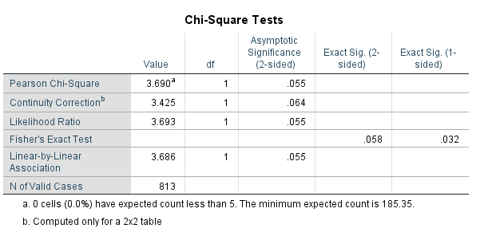

```{r setup, include=FALSE}
knitr::opts_chunk$set(echo = TRUE)
```

# Discovered potential minor error in reporting of omnibus statistics

Dear authors,

I am currently reanalyzing your 2014 replication of Williams and Bargh (2008) for an example. I discovered what I believe could be a minor error in the reported statistics for the omnibus test across labs. In the paper, the test is reported as follows: $\chi^2 (1) = 3.402$, $p = .065$, $OR = 0.77$, $95\% CI = [.58, 1.02]$.

However, when analyzing the omnibus_data_bargh.sav in R using the syntax_barghrep_forOSF.sps script, I get the following values for the omnibus:



In other words, the $\chi^2$ and $p$ value does not seem to correspond between the paper and the dataset on OSF. Note that the difference is minor. and in case of a mistake it should not change the overall conclusions. I did not do an exhaustive check of all statistics, but the $\chi^2$ tests from each individual test site appears to be correct at least (assuming no continuity correction).

I am planning to include your omnibus in an example for a paper (submission deadline Nov 13th). Could you possibly check whether I am correct by then?

I hope you find the notification useful, and should it turn out that this is somehow a mistake on my end, appologies in advance!    
  
  
  
Kind regards, 
Peder M. Isager